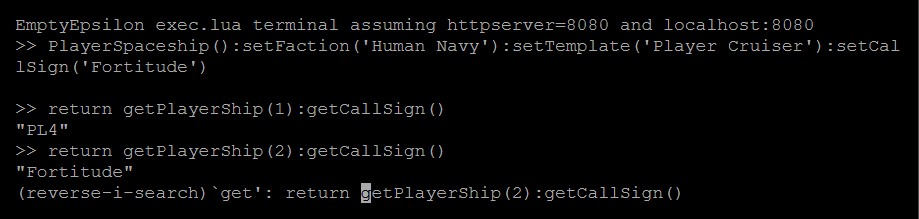

# An EmptyEpsilon terminal

Run Lua code via the [exec.lua endpoint](https://github.com/daid/EmptyEpsilon/wiki/HTTP-Server) of EmptyEpsilon's HTTP API as if it were a basic, mostly broken terminal. Just a minimal wrapper of jQuery Terminal around POSTs to the endpoint.

Accepts basic keyboard commands common to [jQuery Terminals](https://terminal.jcubic.pl/api_reference.php#shortcuts), including command history via <kbd>CTRL</kbd>+<kbd>R</kbd>.

## Installation

1.  Place the files from this repository in the `www` subdirectory of EmptyEpsilon.
2.  Enable EmptyEpsilon's `httpserver` either in `options.ini` or as a command-line option, on port 8080.
3.  Launch a game as the server.
4.  Open http://localhost:8080.

## Usage

The terminal passes input to `exec.lua` without verification, and returns responses.

For example:

```
>> return getPlayerShip(-1):getCallSign()
"PL4"
```


